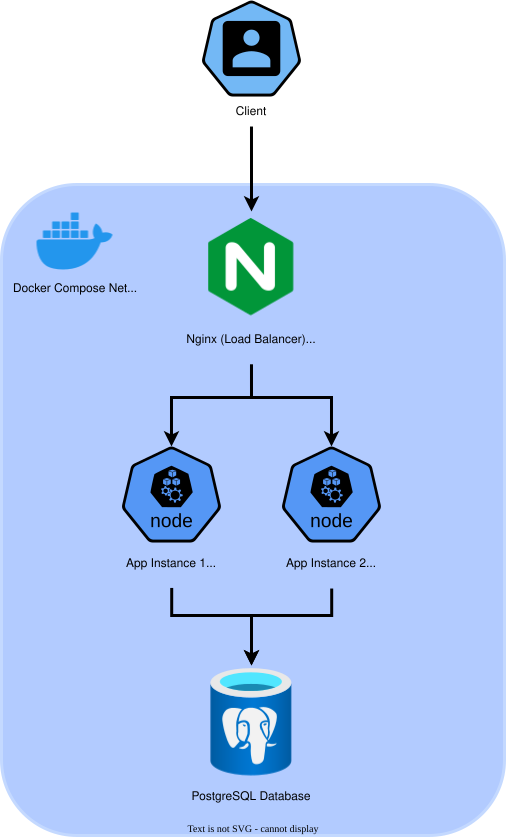

# Simple Stock Market

Service simulating a simplified stock market REST API.

## Tech Stack

- **Runtime**: Node.js
- **Language**: TypeScript
- **Framework**: Express
- **Database**: PostgreSQL
- **Infrastructure**: Docker Compose (2 app instances + PostgreSQL + Nginx load balancer)
- **Integration Tests**: Jest + Supertest
- **Stress Tests**: k6

## How to Run

**Prerequisites:** Docker Desktop installed and running.

### Linux / macOS
```bash
# Make executable (first time only)
chmod +x start.sh

# Enter one of those lines
./start.sh            # default port (3000)
./start.sh 8080       # custom port
```

### Windows (PowerShell)
```powershell
# Enter one of those lines
.\start.ps1           # default port (3000)
.\start.ps1 8080      # custom port
```

API will be available at http://localhost:PORT

To stop:
```bash
docker compose down
```

## Testing

### Integration Tests

```bash
npm test
```

See [test plan](src/docs/test-plan.md) for a full list of covered cases.

### Stress Tests

#### Linux / macOS
```bash
# Make executable (first time only)
chmod +x stress-test.sh

# Enter one of those lines
./stress-test.sh         # default port (3000)
./stress-test.sh 8080    # custom port
```

#### Windows (PowerShell)
```powershell
# Enter one of those lines
.\stress-test.ps1        # default port (3000)
.\stress-test.ps1 8080   # custom port
```

Stress test resets the database, starts the app, and runs 1000 concurrent operations across 10 virtual users.

## Architecture Diagram



## Architecture Decisions

- **Express.js instead of NestJS:** To maintain simplicity and avoid over-engineering for a system with limited scale and rigid requirements, a lightweight framework was chosen. This allows for clear, explicit route definitions similar to Minimal API approaches.
- **Raw SQL over ORM:** Direct SQL queries via `pg` provide absolute control over critical database transactions, which are essential for financial applications to prevent race conditions during concurrent requests.
- **Audit Log Independence:** The `audit_log` table intentionally lacks foreign key constraints to the `wallets` and `bank_stocks` tables. This ensures the log remains an immutable, append-only historical record, even if wallet records were to be archived or deleted in the future.
- **Wallet Holdings Independence:** The `wallet_stocks` table intentionally has no foreign key constraint to `bank_stocks`. This allows wallets to retain and sell stocks even after they are removed from the bank via `POST /stocks`. Wallets are created lazily — only upon a successful buy operation. A sell attempt on a non-existent wallet returns 400 without creating the wallet, as there are no stocks to sell.
- **High Availability (Active-Active):** Two application instances run concurrently behind an Nginx load balancer using a round-robin strategy. Database transactions and row-level locking (e.g., during stock purchases) manage concurrency and prevent double-spending or overselling.

### Project Structure

```
src/
├── controllers/      # Parsing requests and formatting HTTP responses
├── dal/              # Data Access Layer (Raw SQL execution)
├── db/               # Database connection pool and configuration
├── docs/             # Documentation
├── middleware/       # Middleware (error handler)
├── models/           # TypeScript interfaces and DTOs
├── routes/           # Express routing definitions
├── services/         # Core business logic and transaction management
├── app.ts            # Express app setup and middleware configuration
└── index.ts          # Server entry point

tests/
├── integration/
│   ├── helpers/      # Database utilities
│   ├── log.test.ts
│   ├── stocks.test.ts
│   └── wallets.test.ts
└── stress/
    └── buy_sell.js   # k6 stress test scenario
```

## API Endpoints

| Method | Endpoint | Description |
|--------|----------|-------------|
| `GET` | `/wallets/:wallet_id` | Get wallet with all stocks |
| `GET` | `/wallets/:wallet_id/stocks/:stock_name` | Get quantity of a specific stock in wallet |
| `POST` | `/wallets/:wallet_id/stocks/:stock_name` | Buy or sell a stock (`{ "type": "buy"/"sell" }`) |
| `GET` | `/stocks` | Get all available bank stocks |
| `POST` | `/stocks` | Set bank stocks (`{ "stocks": [{ "name": "AAPL", "quantity": 10 }] }`) |
| `GET` | `/log` | Get audit log of all transactions |
| `POST` | `/chaos` | Kills one app instance |